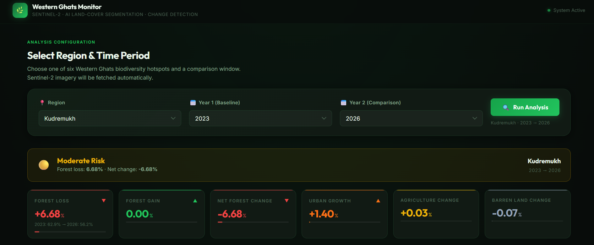
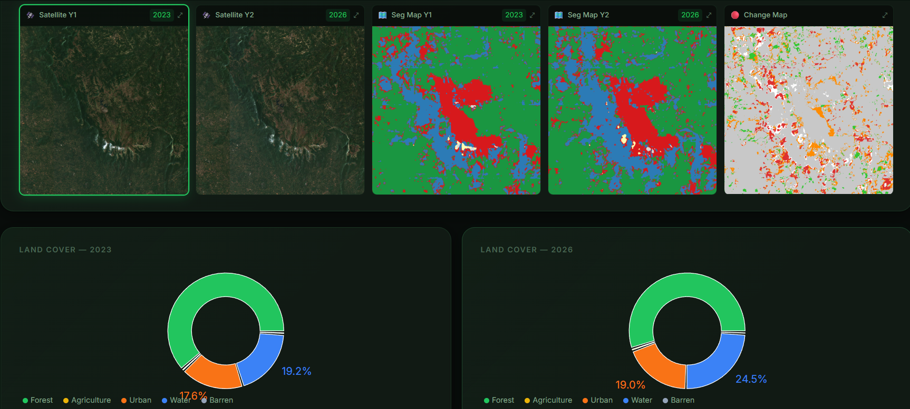
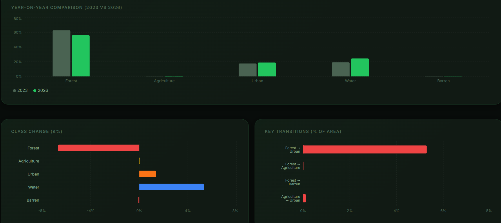
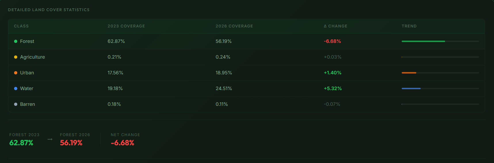
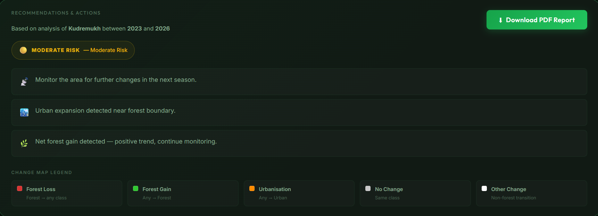
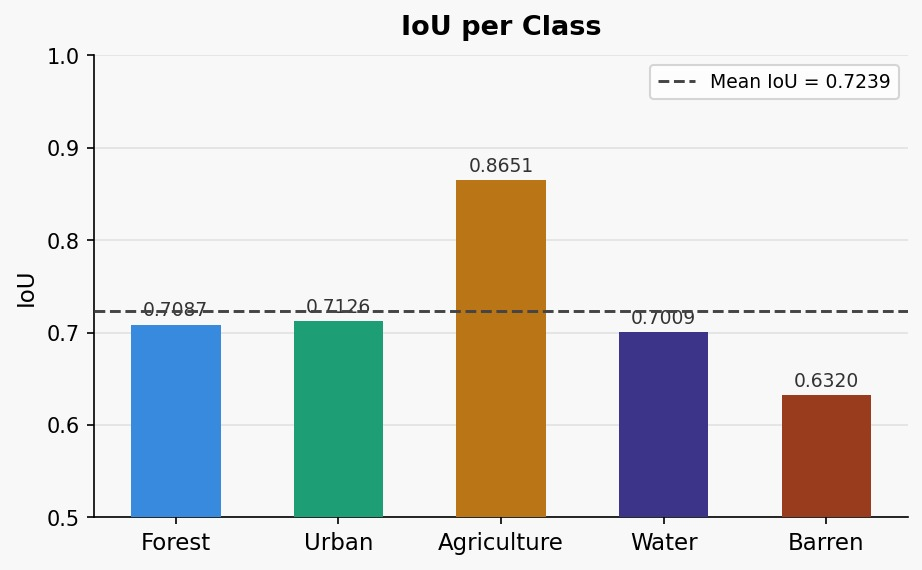
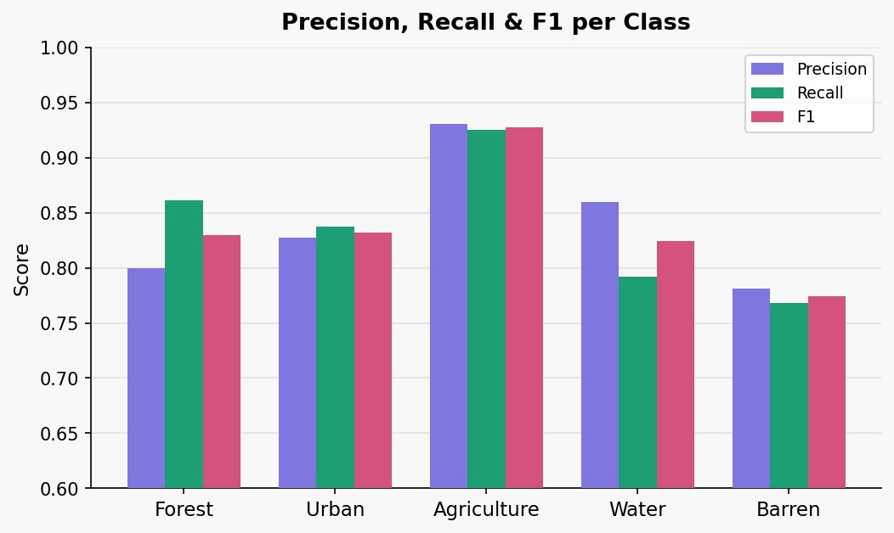
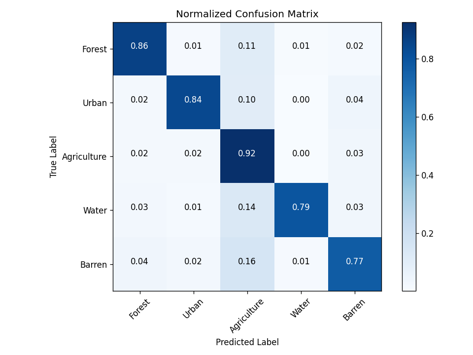

<div align="center">

# 🌿 Western Ghats Monitor

**AI-powered deforestation & land-cover change detection across six Western Ghats biodiversity hotspots**

[](https://python.org)
[](https://fastapi.tiangolo.com)
[](https://reactjs.org)
[](https://pytorch.org)
[](LICENSE)

*Powered by Sentinel-2 satellite imagery · U-Net ResNet-34 segmentation · Google Earth Engine*

</div>

---

## 📸 Prototype Screenshots

<table>
  <tr>
    <td align="center"><b>Dashboard Overview & Risk Alert</b></td>
    <td align="center"><b>Satellite Imagery & Segmentation Maps</b></td>
  </tr>
  <tr>
    <td></td>
    <td></td>
  </tr>
  <tr>
    <td align="center"><b>Year-on-Year Change Analysis</b></td>
    <td align="center"><b>Detailed Land Cover Statistics</b></td>
  </tr>
  <tr>
    <td></td>
    <td></td>
  </tr>
  <tr>
    <td colspan="2" align="center"><b>Recommendations & Actionable Insights</b></td>
  </tr>
  <tr>
    <td colspan="2" align="center"></td>
  </tr>
</table>

---

## ✨ Features

- 🛰️ **Live Satellite Imagery** — Fetches Sentinel-2 median composites dynamically via Google Earth Engine
- 🧠 **AI Segmentation** — U-Net with ResNet-34 encoder classifies every pixel into 5 land-cover classes
- 📊 **Change Detection** — Compares any two years, computes transition matrices and class deltas
- ⚠️ **Risk Alerts** — Automatically flags Critical / High / Moderate / Low forest-loss risk
- 📋 **PDF Reports** — One-click downloadable stakeholder reports generated by ReportLab
- 🗺️ **Six Regions** — Bandipur, Wayanad, Nagarhole, Coorg, Sakleshpur, Kudremukh

---

## 🏗️ System Architecture

```
┌─────────────────────────────────────────────────────────┐
│                     React Frontend                       │
│  Control Panel · Image Grid · Charts · Change Table      │
│          Recommendations · PDF Download                  │
└────────────────────────┬────────────────────────────────┘
                         │  REST API (Axios)
┌────────────────────────▼────────────────────────────────┐
│                  FastAPI Backend                          │
│   /analyze · /regions · /health · /report/{file}         │
└──────┬──────────────────────────────────┬───────────────┘
       │                                  │
┌──────▼──────┐                  ┌────────▼──────────────┐
│ Google      │                  │  PyTorch AI Core       │
│ Earth       │                  │  U-Net ResNet-34       │
│ Engine      │                  │  Tile → Infer → Stitch │
│ (Sentinel-2)│                  └────────┬───────────────┘
└─────────────┘                           │
                                 ┌────────▼───────────────┐
                                 │  Change Detection +     │
                                 │  ReportLab PDF Engine   │
                                 └────────────────────────┘
```

---

## 📁 Project Structure

```
ghats-watch/
├── README.md
├── requirements.txt          ← Root-level Python dependencies
├── .gitignore
│
├── assets/                   ← Screenshots & model evaluation plots
│
├── backend/                  ← FastAPI server
│   ├── main.py               ← API routes
│   ├── gee_loader.py         ← Google Earth Engine imagery fetcher
│   ├── inference.py          ← Tile → infer → stitch pipeline
│   ├── change_detection.py   ← Change analysis & alert logic
│   ├── report_generator.py   ← PDF report generator
│   └── requirements.txt      ← Backend-specific dependencies
│
├── config/
│   ├── settings.py           ← Regions, class maps, thresholds
│   └── ml_config.py          ← Training hyperparameters & paths
│
├── frontend/                 ← React dashboard
│   ├── src/
│   │   ├── App.js
│   │   ├── api.js            ← Axios API client
│   │   └── components/       ← Dashboard components
│   └── package.json
│
├── scripts/
│   └── run_backend.py        ← One-command backend launcher (Windows-friendly)
│
└── src/                      ← ML training & evaluation scripts
    ├── model.py              ← U-Net model definition
    ├── dataset.py            ← DeepGlobe dataset loader
    ├── loss.py               ← Combined CE + Dice loss
    ├── train.py              ← Training loop
    ├── train_full.py         ← Full training with logging
    ├── eval.py               ← Evaluation script
    └── eval_full.py          ← Full evaluation with metrics export
```

> **Note:** `checkpoints/` (model weights), `dataset/`, `reports/`, and `exports/` are listed in `.gitignore` and must be set up locally — see instructions below.

---

## 🚀 Quick Start

### 1. Clone the repository

```bash
git clone https://github.com/<your-username>/ghats-watch.git
cd ghats-watch
```

### 2. Set up the Python backend

```bash
# Create and activate a virtual environment (recommended)
python -m venv .venv

# Windows
.venv\Scripts\activate

# macOS / Linux
source .venv/bin/activate

# Install dependencies
pip install -r requirements.txt
```

### 3. Authenticate with Google Earth Engine

You need a [Google Earth Engine](https://earthengine.google.com/) account and an active GEE Cloud project.

```bash
pip install earthengine-api
earthengine authenticate
```

A browser window will open — sign in with the Google account linked to your GEE project. Then test it:

```bash
python -c "import ee; ee.Initialize(project='YOUR_GEE_PROJECT_ID'); print('GEE OK')"
```

> Update `config/settings.py` with your GEE project ID if needed.

### 4. Add the trained model weights

Download `best_model.pth` and place it at:

```
checkpoints/best_model.pth
```

### 5. Install and run the React frontend

```bash
cd frontend
npm install
npm start
```

This starts the frontend at **http://localhost:3000**

### 6. Start the backend (new terminal)

**Option A — convenience launcher (Windows-friendly):**
```bash
python scripts/run_backend.py
```

**Option B — uvicorn directly:**
```bash
uvicorn backend.main:app --reload --port 8001
```

API is live at **http://localhost:8001** · Interactive docs at **http://localhost:8001/docs**

---

## 🌐 API Reference

| Method | Endpoint | Description |
|--------|----------|-------------|
| `GET` | `/health` | Server + model status |
| `GET` | `/regions` | List of supported regions |
| `POST` | `/analyze` | Run full analysis pipeline |
| `GET` | `/report/{file}` | Download generated PDF report |

### Example `/analyze` request

```bash
curl -X POST http://localhost:8001/analyze \
  -H "Content-Type: application/json" \
  -d '{"region": "Kudremukh", "year1": 2020, "year2": 2024}'
```

---

## 🗺️ Supported Regions

| Region | Bounding Box (W, S, E, N) |
|--------|--------------------------|
| Bandipur | 76.15, 11.55, 76.85, 12.05 |
| Wayanad | 75.75, 11.45, 76.45, 12.15 |
| Nagarhole | 75.90, 11.75, 76.40, 12.30 |
| Coorg | 75.50, 12.00, 76.20, 12.75 |
| Sakleshpur | 75.60, 12.70, 75.95, 13.15 |
| Kudremukh | 75.00, 13.00, 75.45, 13.45 |

---

## 🎨 Land Cover Classes

| Index | Class | Colour |
|-------|-------|--------|
| 0 | 🟢 Forest | Green |
| 1 | 🟡 Agriculture | Yellow |
| 2 | 🔴 Urban | Red |
| 3 | 🔵 Water | Blue |
| 4 | ⚪ Barren | Grey |

---

## ⚠️ Alert Levels

| Forest Loss | Alert Level |
|-------------|-------------|
| > 20% | 🔴 Critical Risk |
| > 10% | 🟠 High Risk |
| > 5% | 🟡 Moderate Risk |
| ≤ 5% | 🟢 Low Risk |

---

## 🤖 Model Performance

Architecture: **U-Net with ResNet-34 encoder** (ImageNet pretrained)  
Training data: **DeepGlobe Land Cover Dataset** (803 images)

| Metric | Score |
|--------|-------|
| Validation mIoU | **0.714** |
| Pixel Accuracy | **87.86%** |
| Input size | 256 × 256 RGB tiles |
| Output | 5-class segmentation map |

<table>
  <tr>
    <td align="center"><b>IoU per Class</b></td>
    <td align="center"><b>Precision · Recall · F1 per Class</b></td>
  </tr>
  <tr>
    <td></td>
    <td></td>
  </tr>
</table>

<div align="center">
  <b>Normalized Confusion Matrix</b><br/>
  
</div>

---

## ⚙️ Methodology

1. **Data Acquisition** — Sentinel-2 median annual composites fetched dynamically from Google Earth Engine for any selected region and year range.

2. **Preprocessing** — Regional bounding boxes (1024 × 1024 px) are tiled into 256 × 256 patches with a 32-pixel overlap to eliminate edge artifacts.

3. **Segmentation** — U-Net (ResNet-34 encoder) classifies each pixel into one of five land-cover classes across all tiles.

4. **Change Detection** — Segmentation maps from Year 1 and Year 2 are compared pixel-wise. The system computes net class changes, specific transitions (e.g. Forest → Urban), and a full transition matrix.

5. **Reporting** — Risk alert levels are assigned based on forest-loss thresholds. Ecological reasoning, conservation steps, and ESZ enforcement recommendations are generated automatically and compiled into a downloadable PDF.

---

## 🛠️ Tech Stack

| Layer | Technology |
|-------|-----------|
| Frontend | React 18, Recharts, Axios |
| Backend | FastAPI, Uvicorn |
| AI / ML | PyTorch, segmentation-models-pytorch (U-Net ResNet-34) |
| Satellite Data | Google Earth Engine API, Sentinel-2 L2A |
| PDF Generation | ReportLab |
| Training Data | DeepGlobe Land Cover Dataset |

---

## 📄 License

This project is licensed under the **MIT License** — see [LICENSE](LICENSE) for details.

---

<div align="center">
  Made with 🌱 for the conservation of the Western Ghats biodiversity hotspot
</div>
